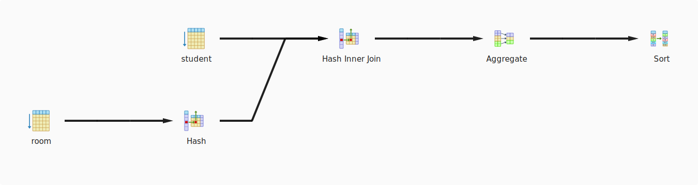
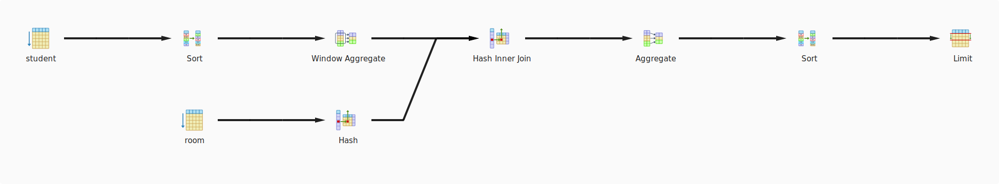
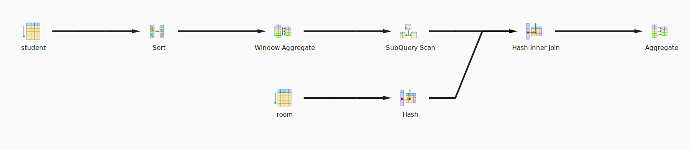

# Task 1. Python


## Script for creating database schema

```postgresql
CREATE SCHEMA IF NOT EXISTS dorm_schema;

CREATE TABLE IF NOT EXISTS dorm_schema.room
(
    id integer PRIMARY KEY,
    name character varying(100)
);

CREATE TABLE IF NOT EXISTS dorm_schema.student
(
    id integer PRIMARY KEY,
    name character varying(100),
    birthday date,
    sex char(1),
    room integer REFERENCES dorm_schema.room(id)
);
```

## Queries

### 1. Number of students in each room
  ```postgresql
  SELECT dorm_schema.room.name AS name,
         count(*) AS number_of_students
  FROM dorm_schema.student
  INNER JOIN dorm_schema.room
  ON dorm_schema.student.room = dorm_schema.room.id
  GROUP BY dorm_schema.room.name
  ORDER BY number_of_students DESC
  ```


### 2. Top 5 rooms with min average age
  ```postgresql
  SELECT dorm_schema.room.name AS name,
         avg_age
  FROM
    (SELECT dorm_schema.student.room AS room_number, 
            AVG(DATE_PART('year', CURRENT_DATE) - DATE_PART('year', dorm_schema.student.birthday)) 
            OVER (PARTITION BY dorm_schema.student.room) 
            AS avg_age
     FROM dorm_schema.student
    ) AS avg_table
  INNER JOIN dorm_schema.room
  ON dorm_schema.room.id = avg_table.room_number
  GROUP BY dorm_schema.room.name, 
           avg_age
  ORDER BY avg_age ASC
  LIMIT 5
```


### 3. Top 5 rooms with the highest difference in age
  ```postgresql
  SELECT dorm_schema.room.name AS name, 
         age_diff
  FROM
    (SELECT dorm_schema.student.room AS room_number,
            MAX(DATE_PART('year', CURRENT_DATE) - DATE_PART('year', dorm_schema.student.birthday)) 
            OVER (PARTITION BY dorm_schema.student.room) -  
            MIN(DATE_PART('year', CURRENT_DATE) - DATE_PART('year', dorm_schema.student.birthday)) 
            OVER (PARTITION BY dorm_schema.student.room) AS age_diff
     FROM dorm_schema.student
    ) AS diff_table
  INNER JOIN dorm_schema.room
  ON dorm_schema.room.id = diff_table.room_number
  GROUP BY dorm_schema.room.name, 
           age_diff
  ORDER BY age_diff DESC
  LIMIT 5
```


### 4. Rooms where live students of both sexes
  ```postgresql
  SELECT dorm_schema.room.name AS name
  FROM
    (SELECT dorm_schema.student.room AS room_number, 
            sex,
            MAX(dorm_schema.student.sex) 
            OVER (PARTITION BY dorm_schema.student.room) AS sex1,  
            MIN(dorm_schema.student.sex) 
            OVER (PARTITION BY dorm_schema.student.room) AS sex2
     FROM dorm_schema.student
    ) AS sex_table
  INNER JOIN dorm_schema.room
  ON dorm_schema.room.id = sex_table.room_number
  AND sex_table.sex1 != sex_table.sex2
  GROUP BY dorm_schema.room.name
```


## Script for creating indexes
  ```postgresql
  CREATE INDEX idx_student_birthday ON dorm_schema.student(birthday);
```


